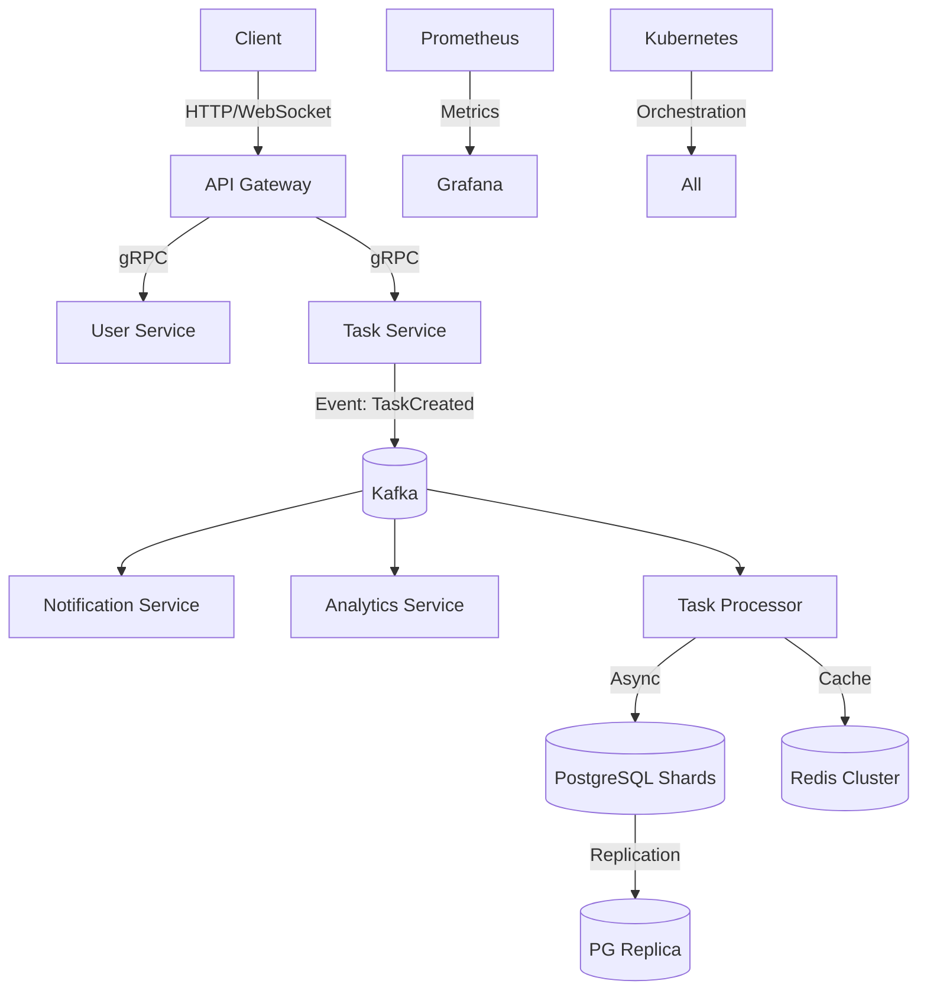
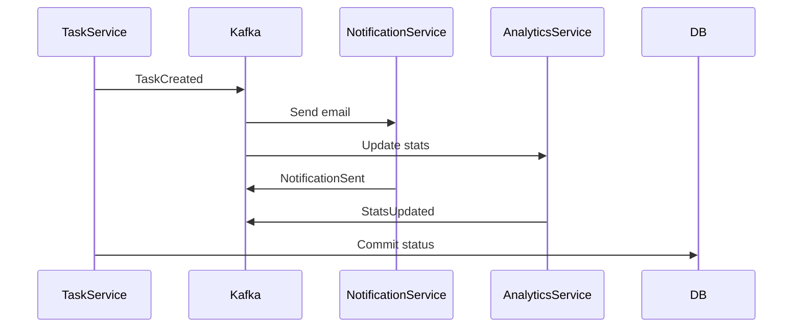

# Event-driven task tracker

Распределенный трекер задач с архитектурой, управляемой событиями.

Ключевые фичи:
- Автомасштабирование воркеров на основе очереди (RabbitMQ/Kafka).
- Шардирование БД по user_id.
- Распределённый кеш запросов (Redis Cluster).
- Мониторинг метрик (латентность, ошибки) через Prometheus.
- Асинхронные уведомления через WebSockets.

## Начальное описание проекта для разработки

### Архитектурная схема системы

## Стек технологий | Production-Grade

1) Ядро:
    - API: FastAPI (ASGI + async) + gRPC для межсервисного взаимодействия
    - Event Streaming: Apache Kafka (с KSQL для обработки событий)
    - БД: PostgreSQL 15 с шардированием через Citus или pg_partman
    - Кеш: Redis 7+ (кластерный режим)

2) Инфраструктура:
    - Оркестрация: Kubernetes (minikube для локального развёртывания)
    - Мониторинг: Prometheus + Grafana + Jaeger (трассировка)
    - CI/CD: GitGub Actions с канальными тестами (unit → integration → load)

3) Безопасность:
    - JWT-аутентификация с OAuth2 (Возможно отдельный Auth Api-шлюз)
    - RBAC (ролевая модель)
    - Шифрование данных в rest (pgcrypto) и transit (TLS 1.3)

### Стоит реализовать в проекте

1) Event-Driven ядро (в Kafka)
    - продумать protobuf-схемы событий для использования gRPC
    - при обработке учесть Consumer группы для масштабирования воркеров, Dead Letter Queue (DLQ) для обработки фейлов и Exactly-once семантика через Kafka Transactions

2) Шардиорвание PostgreSQL
    - шардирование по user_id (range-based)
    - сконфигурировать Alemic миграции на поддержку шардов

3) Асинхронная обработка задач
    - сами задачи будут проходить этапы (назначение задачи → нотификация → обновление дашборда). Поэтому необходимо применить паттерн Сага (Saga Pattern) для управления распределенными транзакциями

### Оптимизации производительности

Кеширование:
    - L1-кеш в Redis (результаты запросов)
    - L2-кеш в памяти сервиса (caches LRU для частых операций

Индексы:
    - подобрать типы индексов под типы данных (например, если будет использоваться привязка к геолокации использовать GiST индексы)
    - еще имеет смысл рассмотреть частичные индексы  (Partial) для статусов задач (`WHERE status = "active"`)

### Мониторинг и отказоустойчивость

Healthchecks:
    - /health эндпоинты для всех сервисов + интеграция с Kubernetes livenessProbe.

Circuit Breaker:
    - для изоляции падающих сервисов (PyBreaker) (помимо restart политик в конфигурации кубера)

## Дорожная карта | Roadmap

> перенести после согласования в Kanban доску в Github Projects

> сроки увеличены вдвое, чтобы делать проект в спокойном темпе!
---

Этап 1: MVP (4 недели)

1) Ядро
    - FastAPI: эндпоинты CRUD для задач
    - Аутентификация JWT
    - Простая PostgreSQL (без шардинга)

2) События
    - Отправка событий в Kafka при создании/изменении задачи
    - Consumer: нотификации на email (через Celery/RabbitMQ)

3) Деплой:
    - Docker-compose (API, Kafka, PostgreSQL, Redis)

Этап 2: Доработка функциональной части (6 недель)

1) Насройка шардов для БД
    - Разделение данных на 4 шарда по user_id
    - Миграция данных с помощью pglogical

2) Кеширование
    - Redis Cluster: кеширование `GET /tasks/{id}`
    - настройка инвалидации кеша при обновлении задачи

3) Оптимизация Kafka
    - репликации топиков (`replication-factor=3`)
    - добавление KSQL для real-time агрегации статистики

Этап 3: Подготовка к production (6 недель)

1) Безопасность
    - Ролевая модель (`ADMIN`, `USER`, `GUEST`)
    - ограничить rate-limit - 100 RPM на пользователя

2) Отказоустойчивость
    - имплементация Saga для отката транзакций
    -  алерты в Grafana (ошибки >1%, latency >500ms)

3) Тестирование
    - Нагрузочные тесты Locust (1000 RPS) (либо аналог)
    - Хаос-тесты (отключение шарда БД, перезапуск Kafka)

---

    Реализовать в проекте:
    - Outbox Pattern для гарантированной доставки событий
    - Кастомный Connection Pool для работы с шардированной БД
    - Оптимизацию запросов через Materialized Views
    - Написать тесты на проверку консистентности данных при падении Kafka.

Этот проект лицензирован по лицензии [CC BY-NC-SA 4.0](https://creativecommons.org/licenses/by-nc-sa/4.0/).
