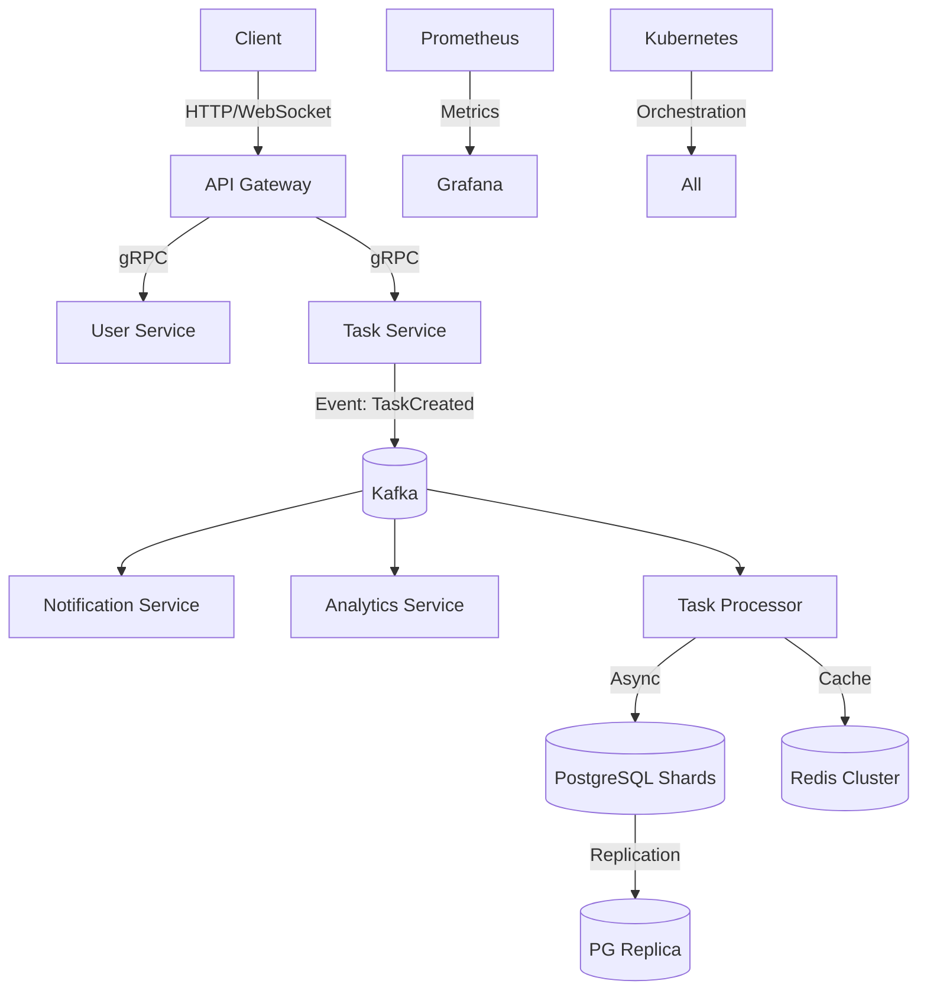
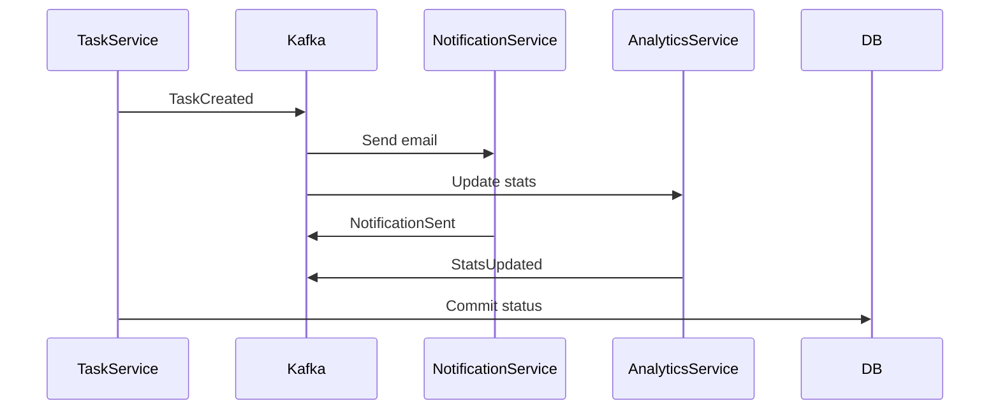

## Архитектурная схема системы

```mermaid
graph TD
    A[Client] -->|HTTP/WebSocket| B[API Gateway]
    B -->|gRPC| C[User Service]
    B -->|gRPC| D[Task Service]
    D -->|Event: TaskCreated| E[(Kafka)]
    E --> F[Notification Service]
    E --> G[Analytics Service]
    E --> H[Task Processor]
    H -->|Async| I[(PostgreSQL Shards)]
    H -->|Cache| J[(Redis Cluster)]
    I -->|Replication| K[(PG Replica)]
    L[Prometheus] -->|Metrics| M[Grafana]
    N[Kubernetes] -->|Orchestration| All
```

## Асинхронная обработка задач

паттерн Сага (Saga Pattern) для управления распределенными транзакциями

```mermaid
sequenceDiagram
  TaskService->>Kafka: TaskCreated
  Kafka->>NotificationService: Send email
  Kafka->>AnalyticsService: Update stats
  NotificationService->>Kafka: NotificationSent
  AnalyticsService->>Kafka: StatsUpdated
  TaskService->>DB: Commit status
```
